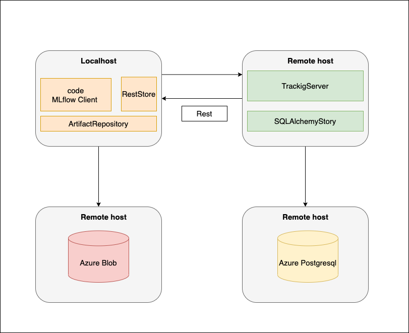

## Deploy MLflow Traking Platform into Heroku

### Overall Architecture


### Installation Steps 

1. Clone code 
```
git clone git@github.com:zhangruochi/mlflow-for-heroku.git
```
2. Install heroku
```
sudo snap install --classic heroku
```
or if you use Mac
```
brew tap heroku/brew && brew install heroku
```
3. Login
```
heroku login
```
4. Create your heroku app 
```
heroku apps:create <heroku-app-name>
```
5. Create Azure Blob Contrainer for artifacts store and Azure Postgresql Database for experimental results
6. Modify `CMD` command in Dockerfile and fill in your blob contrainer path and Postgresql Database path
```
CMD mlflow server \
    --backend-store-uri postgresql://<> \
    --default-artifact-root wasbs://<> \
    --host 0.0.0.0 \
    --port $PORT
```
7. Push code to heroku, it will build Docker images on Heroku automatically
```
git add -A
git commit -m "create mlflow"
git push heroku master
```
8. Set Run time Environment Variables 
```
heroku config:set AZURE_STORAGE_CONNECTION_STRING=<Your String>
```